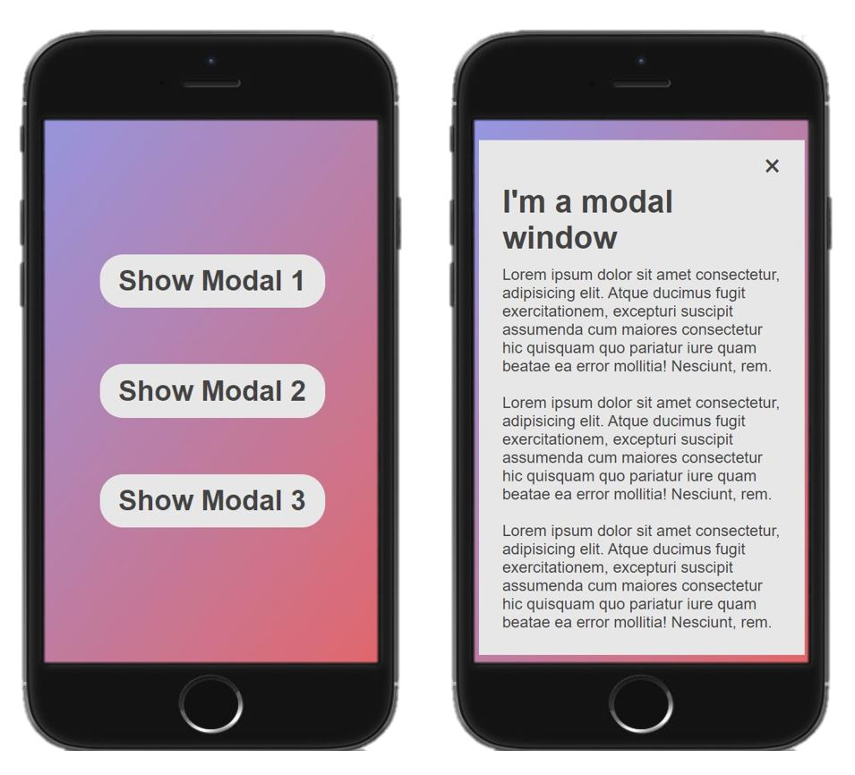

# Modal Window

This is a basic project of a modal window template for a webpage. A modal window is a control element subordinate to an app's main window. In other words, it's an element that is hidden within the page's body that pops up with a trigger that may be a specific use action such as a button click.

The webpage only displays three buttons that when clicked open a div containing information about it. It is useful to get user input or show further information to the user in a very fancy way with a bit more of work on the background 😁

Feel free to take a peek <a href="https://brenoingwersen.github.io/js-modal-window/">Link</a>

Here are some screenshots:

